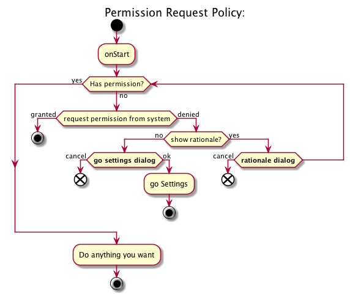

# Permission Requester

[中文](README.zh.md)

Permission Reuquester is a simple permission request activity that let you grant permissions easylly, with a standard policy, that covers all of situations relative.

## Background

[Requesting permissions at run time](https://developer.android.com/training/permissions/requesting.html) is a new feature added from Android 6.0 (API level 23), users grant permissions to apps while the app is running, not when they install the app. An App target at 23 or above, need to requesting the "Dangerous" permission at run time.

There is lot of things to do.

You need to [Check For Permissions](https://developer.android.com/training/permissions/requesting.html#perm-check) to see if the permissions are granted. If not, you need to [Request the permissions you need](https://developer.android.com/training/permissions/requesting.html#make-the-request), and you may need to [Explain why the app needs permissions](https://developer.android.com/training/permissions/requesting.html#explain). Somethings you also need to [Handle the permissions request response](https://developer.android.com/training/permissions/requesting.html#handle-response) to do things after permission granted. What's more, if user selected "Don't ask again", you will not have a chance to requesting permissions from App, then you may need to guide user to settings to open the permissions.

## Workflow

Here is a workflow for permission request policy:



When you start requesting permission with `PermissionRequestActivity`, it will first check if we already have permission. If don't, show system permission requesting dialogs to ask for permissions. Then show a "rationale dialog" for user if he denied the permissions, or show a "go settings dialog" to guide user to settings when he click "Don't ask again".

## Usage

If you don't need response when requesting finished, all you need to do is to start the `PermissionRequestActivity` using:

``` java
PermissionRequestActivity.start(context, PERMISSIONS, rationalMsg, goSettingsMsg);
```

You can even start this activity from background Service.

If you care about the requesting response, start `PermissionRequestActivity` from your activity:

``` java
PermissionRequestActivity.start(activity, REQUEST_CODE, PERMISSIONS, rationalMsg, goSettingsMsg);
```

Then, handle the activity result in `onActivityResult`:

``` java
@Override
protected void onActivityResult(int requestCode, int resultCode, Intent data) {
    super.onActivityResult(requestCode, resultCode, data);
    if (requestCode == REQUEST_CODE) {
        if (resultCode == RESULT_OK) {
            // Permission granted
        } else {
            // Permission denied
        }
    }
}
```

You can also override `showRationaleDialog` to show a custom rationale dialog when need:

``` java
/**
 * Override this method to show custom dialog.
 * @param canRequestAgain if true, show request again dialog, else, show go settings dialog
 * @param message dialog message
 * @param dialogResult always have a result for user action
 *                     (ok - > positive/cancel -> negative/dismiss -> negative)
 */
@Override
protected void showRationaleDialog(final boolean canRequestAgain, String message,
                                   final @NonNull DialogResult dialogResult) {
    AlertDialog alertDialog = new AlertDialog.Builder(this)
            .setMessage(message)
            .setCancelable(true)
            .setPositiveButton(android.R.string.ok, new OnClickListener() {
                @Override
                public void onClick(DialogInterface dialogInterface, int i) {
                    dialogInterface.dismiss();
                    dialogResult.onPositive();
                }
            })
            .setNegativeButton(android.R.string.cancel, new OnClickListener() {
                @Override
                public void onClick(DialogInterface dialogInterface, int i) {
                    dialogInterface.cancel();
                }
            })
            .setOnCancelListener(new OnCancelListener() {
                @Override
                public void onCancel(DialogInterface dialogInterface) {
                    dialogInterface.dismiss();
                    dialogResult.onNegative();
                }
            })
            .show();
    alertDialog.setCanceledOnTouchOutside(true);
}
```

## Contribution

Feel free to create [issues](https://github.com/tankery/permission-requester/issues) when you find some bug or have some suggestions. And [Pull Request](https://github.com/tankery/permission-requester/pulls) is welcome. Thanks for your attention~


